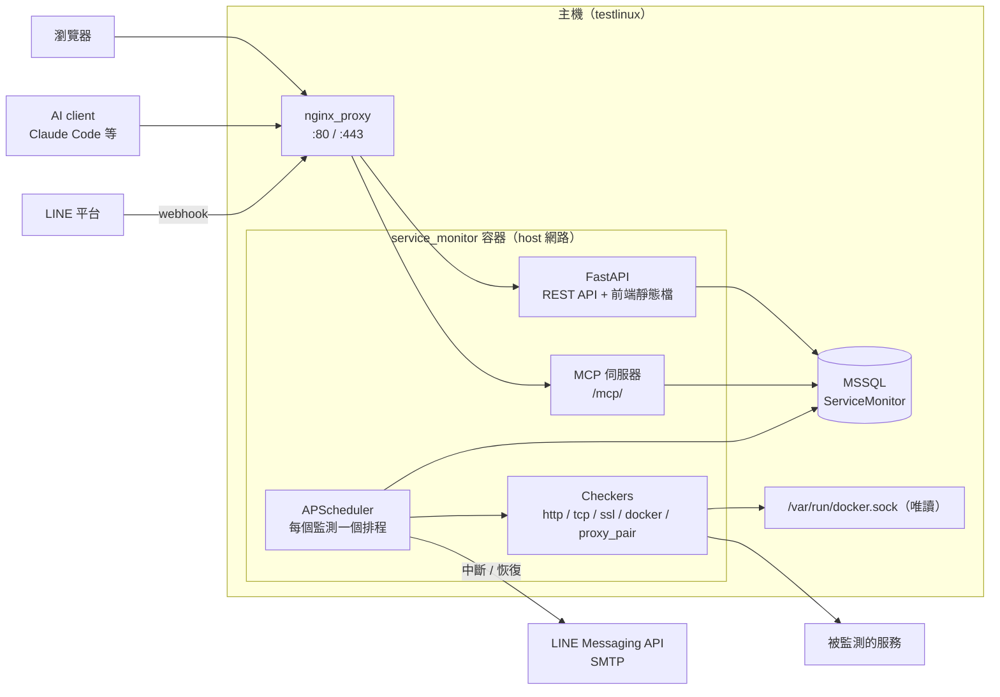

# 服務監控平台（Service Monitor）

自架的服務可用性監控平台：定時檢查網站、nginx 轉發、TCP 連接埠、SSL 憑證與 Docker 容器，服務中斷或恢復時，透過 **多個 LINE 官方帳號** 與 **Email** 通知指定的人。另提供 **MCP 通道**，讓 AI（Claude Code 等）直接查詢與新增監測。

- 正式網址：https://monitor.careloger.com
- 技術：FastAPI · APScheduler · SQLAlchemy（MSSQL）· Vue 3 · Element Plus · ECharts · MCP Python SDK 2.x
- 部署：單一 Docker 容器，`network_mode: host`，只綁 `127.0.0.1:8090`，由 nginx 對外

---

## 目錄

- [功能總覽](#功能總覽)
- [架構](#架構)
- [專案結構](#專案結構)
- [安裝與部署](#安裝與部署)
- [環境變數](#環境變數)
- [監測類型與告警邏輯](#監測類型與告警邏輯)
- [主機與分類](#主機與分類)
- [獨立服務（外部回報）](#獨立服務外部回報)
- [通知設定（LINE / Email）](#通知設定line--email)
- [MCP 通道](#mcp-通道)
- [HTTP API](#http-api)
- [對外開放（nginx + SSL）](#對外開放nginx--ssl)
- [維運](#維運)
- [安全性](#安全性)
- [已知限制](#已知限制)

---

## 功能總覽

| 分類 | 功能 |
|---|---|
| 監測 | HTTP 狀態碼、網頁關鍵字、nginx 轉發（網域 vs 後端）、TCP 連接埠、SSL 憑證到期、Docker 容器狀態與健康檢查、外部回報（其他主機自行監控，通知走本平台） |
| 告警 | 連續失敗 N 次才告警、持續中斷定時重複提醒、恢復通知附中斷時長、維護時段靜音 |
| 通知 | 多個 LINE 官方帳號（Messaging API）、多組 SMTP；聯絡人以「通知群組」對應監測項目，可個別選擇要收的事件 |
| LINE 綁定 | 使用者加好友或在群組輸入「綁定」即自動登記為待啟用聯絡人，管理員一鍵啟用 |
| 介面 | 總覽（依主機 / 標籤分區、心跳條、24h/7d/30d 可用率）、監測列表（分類按鈕篩選）、回應時間圖表、事件時間軸、通知紀錄、深色模式 |
| 主機 | 管理多台主機（IP、OS、區域、資源群組、VM 規格），監測項目歸屬主機 |
| AI | MCP 伺服器（`/mcp/`），以資料庫管理的 API 金鑰驗證 |
| 管理 | 多管理員帳號（資料庫 bcrypt）、API 金鑰管理、維護時段、資料保留天數 |

## 架構



- 前端在 Docker multi-stage build 時打包，由 FastAPI 直接提供，不需另外的 web server。
- 採 host 網路，平台可直接檢查 `127.0.0.1:<port>` 上的後端服務與 MSSQL。
- 檢查失敗的狀態推進、事件開關、通知分派都在 `engine.py`；網頁 API 與 MCP 共用同一套函式。

## 專案結構

```
service-monitor/
├── Dockerfile                 # node 建置前端 → python:3.12-slim 執行
├── docker-compose.yml
├── .env.example
├── backend/
│   ├── requirements.txt
│   └── app/
│       ├── main.py            # FastAPI 入口：路由、MCP 掛載、SPA
│       ├── config.py          # 環境變數設定
│       ├── db.py / models.py  # SQLAlchemy 連線與資料表
│       ├── migrate.py         # 既有資料表的欄位升級
│       ├── seed.py            # 首次啟動建立管理員與預設監測
│       ├── security.py        # JWT、bcrypt、Fernet 加密
│       ├── checkers.py        # 各類型檢查實作
│       ├── engine.py          # 狀態機、事件、觸發通知
│       ├── scheduler.py       # 排程與資料清理
│       ├── notifiers.py       # LINE push / Email 發送與分派
│       ├── webhook.py         # LINE webhook（綁定）
│       ├── mcp_server.py      # MCP 工具與 API 金鑰驗證
│       └── api/               # REST API：auth / monitors / hosts / notify / apikeys
└── frontend/
    └── src/
        ├── views/             # Dashboard / Hosts / Monitors / MonitorDetail / Incidents
        │                      # Notifications / Logs / Settings / Login
        ├── components/        # MonitorForm / HeartbeatBar / LatencyChart
        ├── api/index.js       # axios + 登入狀態
        └── utils.js           # 類型、狀態、分類、格式化
```

## 安裝與部署

### 需求
- Docker 與 Docker Compose v2
- SQL Server（本機使用既有容器 `mssql_2022_rtm_gdr1`）

### 1. 建立資料庫與專用帳號
```bash
docker exec -it mssql_2022_rtm_gdr1 /opt/mssql-tools/bin/sqlcmd -S localhost -U sa -P '<SA 密碼>' -Q "
CREATE DATABASE ServiceMonitor COLLATE Chinese_Taiwan_Stroke_CI_AS;
CREATE LOGIN monitor_app WITH PASSWORD='<強密碼>', CHECK_POLICY=OFF;"
docker exec -it mssql_2022_rtm_gdr1 /opt/mssql-tools/bin/sqlcmd -S localhost -U sa -P '<SA 密碼>' -d ServiceMonitor -Q "
CREATE USER monitor_app FOR LOGIN monitor_app; ALTER ROLE db_owner ADD MEMBER monitor_app;"
```

### 2. 設定 `.env`
```bash
cp .env.example .env
python3 -c 'import base64,os;print(base64.urlsafe_b64encode(os.urandom(32)).decode())'  # → FERNET_KEY
openssl rand -hex 32                                                                  # → JWT_SECRET
chmod 600 .env
```

### 3. 啟動
```bash
docker compose up -d --build
docker compose logs -f
```
第一次啟動會自動建立資料表、管理員 `admin`（初始密碼印在 log，或取自 `ADMIN_INIT_PASSWORD`），並建立這台主機的預設監測（可用 `SEED_DEFAULTS=false` 關閉）。

登入後請先到 **系統設定** 修改密碼。

### 更新
```bash
git pull
docker compose up -d --build
```
資料表新增欄位由 `migrate.py` 在啟動時自動補上。

## 環境變數

| 變數 | 必填 | 說明 |
|---|---|---|
| `DB_URL` | ✔ | `mssql+pymssql://monitor_app:<密碼>@127.0.0.1:1433/ServiceMonitor` |
| `FERNET_KEY` | ✔ | 加密 LINE Token 與 SMTP 密碼。**遺失就無法解密，務必備份** |
| `JWT_SECRET` | ✔ | 登入 Token 簽章金鑰；更換會讓所有人重新登入 |
| `PUBLIC_BASE_URL` | ✔ | 對外網址，用來產生 LINE Webhook URL 與 MCP 允許的 Host |
| `ADMIN_INIT_PASSWORD` | | 僅在 `users` 表為空時使用；不填則隨機產生並印在 log |
| `TZ` | | 通知訊息顯示的時區，預設 `Asia/Taipei` |
| `RETENTION_DAYS` | | 檢查結果與通知紀錄保留天數，預設 90（每日 03:17 清理） |
| `SEED_DEFAULTS` | | 首次啟動是否建立預設監測，預設 `true` |
| `HOST` / `PORT` | | 監聽位址，預設 `127.0.0.1:8090` |

## 監測類型與告警邏輯

| 類型 | 目標格式 | 判定方式 |
|---|---|---|
| HTTP | `https://example.com/health` | 狀態碼落在預期範圍（預設 `200-399`，可寫 `200,301-302`） |
| 關鍵字 | 網址 + 關鍵字 | 狀態碼正常且內容包含關鍵字 |
| 轉發服務 | 對外網址 + 後端網址 | 同時檢查；能分辨「後端中斷」與「後端正常但轉發 / DNS / SSL 異常」 |
| TCP | `host:port` | 能否建立連線 |
| SSL 憑證 | `domain` 或 `domain:port` | 剩餘天數低於門檻（預設 14 天）即視為異常 |
| Docker 容器 | 容器名稱 | 狀態為 running，且有 healthcheck 時必須 healthy（僅限平台所在主機） |
| 外部回報 | 由伺服器產生回報網址 | 對方回報 `down`，或超過「預期回報間隔 + 寬限秒數」未回報 |

**狀態機**

```
UNKNOWN ─▶ UP ─(失敗)─▶ PENDING ─(連續失敗達「告警門檻」次)─▶ DOWN
             ▲                                                │
             └──────────────(任一次成功)──────────────────────┘
```

- 進入 **DOWN**：開啟中斷事件，發送「🔴 服務中斷」通知。
- 持續 **DOWN**：每隔「重複提醒」分鐘發送「🔁 仍然中斷」（0 = 不提醒）。
- 恢復 **UP**：關閉事件，發送「✅ 服務恢復」並附中斷時長。
- **維護時段** 內照常檢查、記錄，但不發通知。

## 主機與分類

- **主機** 頁管理主機資料；監測項目可指定所屬主機，總覽頁預設依主機分區（可切換為依標籤）。
- **監測項目** 頁上方的分類按鈕依用途快速篩選，分類由類型與連接埠自動判斷：

| 按鈕 | 判斷規則 |
|---|---|
| 獨立服務 / 轉發服務 / 網站 / SSL 憑證 / 容器 | 依監測類型 |
| 資料庫 | TCP 連接埠 1433、1521、3306、5432、6379、9200、27017 |
| SSH | TCP 連接埠 22 |
| 遠端桌面 | TCP 連接埠 3389 |
| 其他連接埠 | 其餘 TCP |

按鈕顯示數量，分類內有異常項目時右上角出現紅點。

## 獨立服務（外部回報）

其他主機（例如 Windows 的 MSSQL 主機）可以**自己做監控**，只把結果回報給本平台，由本平台統一發 LINE / Email 通知。也能當作「心跳」：對方主機當機或排程停了，一段時間沒回報就會告警。

1. 新增監測，類型選 **外部回報（獨立服務）**，設定「預期回報間隔」「寬限秒數」、所屬主機與通知群組。
2. 儲存後會自動帶到詳情頁，取得專屬回報網址（含密鑰，請當密碼保管；可重新產生，舊網址立即失效）。
3. 在對方主機設定排程定時呼叫：

```
GET/POST https://monitor.careloger.com/api/push/<密鑰>?status=up|down&msg=<說明>&ping=<毫秒>
```

| 參數 | 說明 |
|---|---|
| `status` | `up`（預設）或 `down` |
| `msg` | 狀態說明，會出現在通知內容 |
| `ping` | 回應時間（毫秒），用於圖表 |

**Linux（cron）**
```bash
# 每分鐘回報還活著
* * * * * curl -fsS -m 10 "https://monitor.careloger.com/api/push/<密鑰>" >/dev/null 2>&1
```

**Windows（PowerShell + 工作排程器）**
```powershell
$Url = "https://monitor.careloger.com/api/push/<密鑰>"
$s = Get-Service -Name MSSQLSERVER
if ($s.Status -eq "Running") { $q = "status=up" }
else { $q = "status=down&msg=" + [uri]::EscapeDataString("MSSQLSERVER 狀態：$($s.Status)") }
Invoke-RestMethod -Uri "$($Url)?$q" -TimeoutSec 10 | Out-Null
```
```bat
schtasks /create /tn "ServiceMonitorPush" /sc minute /mo 1 /ru SYSTEM /f ^
  /tr "powershell -NoProfile -ExecutionPolicy Bypass -File C:\scripts\push-monitor.ps1"
```

詳情頁有完整範例可直接複製。通知內容不會出現密鑰（目標顯示為「外部回報」）。

## 通知設定（LINE / Email）

整體流程：**① 加入 LINE 官方帳號 / SMTP → ② 建立聯絡人 → ③ 放進通知群組 → ④ 監測項目選擇通知群組**

### LINE 官方帳號（可新增多個）
> LINE Notify 已於 2025/3/31 停止服務，本平台使用 **Messaging API** push message。

1. 在 [LINE Developers Console](https://developers.line.biz/console/) 建立 Provider → **Messaging API** channel。
2. 取得 **Channel secret**（Basic settings）與 **Channel access token (long-lived)**（Messaging API 分頁）。
3. 平台「通知設定 → LINE 官方帳號 → 新增」貼上，系統會驗證並產生 **Webhook URL**。
4. 回 LINE Developers 貼上 Webhook URL → Verify → 開啟 **Use webhook**；在 LINE Official Account Manager 關閉自動回應，若要用於群組需開啟「允許加入群組」。
5. 要收通知的人加官方帳號好友，或把官方帳號拉進群組並輸入 `綁定` → 出現在「聯絡人 → 待啟用」→ 管理員啟用。

免費方案有每月推播則數上限，可在官方帳號卡片上查詢用量；可建立多個官方帳號分散額度或分單位使用。

### Email
1. 「通知設定 → Email（SMTP）」新增 SMTP（Gmail：`smtp.gmail.com` / 587 / STARTTLS / 應用程式密碼），可按「寄測試信」確認。
2. 新增 Email 聯絡人，可指定使用哪一組 SMTP（空白則用預設）。

### 通知群組
- 群組 = 一組收件人 + 負責的監測項目（例如「IT 值班」、「醫院專案負責人」）。
- 監測項目也可在編輯表單中勾選群組，並個別選擇要收 **中斷 / 恢復 / 重複提醒**。
- 所有發送結果都記錄在「通知紀錄」，失敗會顯示原因；聯絡人可按「測試」直接發一則測試通知。

## MCP 通道

讓 AI 透過 [Model Context Protocol](https://modelcontextprotocol.io) 查詢與管理監測。

- 端點：`https://monitor.careloger.com/mcp/`（Streamable HTTP，stateless）
- 驗證：`Authorization: Bearer smk_...`（或 `X-API-Key: smk_...`）
- 金鑰：「系統設定 → MCP 通道 / API 金鑰」產生；只存 SHA-256 雜湊，產生時顯示一次，可隨時撤銷並查看最後使用時間。
- 使用說明頁：登入後的 **MCP 說明**（`/mcp-guide`），含各 client 設定、範例對話、即時工具清單（`GET /api/mcp-info`），可直接把連結給使用者。

**Claude Code**
```bash
claude mcp add --transport http service-monitor https://monitor.careloger.com/mcp/ \
  --header "Authorization: Bearer <金鑰>"
```

**JSON 設定（Claude Desktop 等）**
```json
{
  "mcpServers": {
    "service-monitor": {
      "type": "http",
      "url": "https://monitor.careloger.com/mcp/",
      "headers": { "Authorization": "Bearer <金鑰>" }
    }
  }
}
```

**工具**

| 工具 | 說明 |
|---|---|
| `dashboard_summary` | 整體狀態、各主機統計、目前異常項目 |
| `list_hosts` / `create_host` | 查詢 / 新增主機 |
| `list_monitors` | 列出監測（可依主機、狀態過濾） |
| `get_monitor` | 單一監測的設定、可用率、通知群組、最近事件 |
| `create_monitor` / `update_monitor` | 新增 / 修改監測（主機與通知群組用名稱指定；`push` 類型回傳 `push_url`） |
| `set_monitor_enabled` | 暫停 / 恢復 |
| `check_monitor_now` | 立即檢查 |
| `delete_monitor` | 刪除（含歷史紀錄） |
| `test_target` | 不存檔試打目標 |
| `list_notify_groups` / `list_open_incidents` | 查詢通知群組 / 進行中的事件 |

MCP 工具與網頁共用同一套驗證、排程與通知邏輯；參數錯誤時會回傳可讀的原因（例如列出現有主機名稱）。平台本身不呼叫任何 AI，不消耗 AI 額度。

## HTTP API

所有 `/api/*`（除登入外）需 `Authorization: Bearer <登入 Token>`。互動式文件：`/api/docs`。

| 資源 | 端點 |
|---|---|
| 登入 | `POST /api/auth/login`、`GET /api/auth/me`、`POST /api/auth/password` |
| 總覽 | `GET /api/dashboard` |
| 監測 | `GET/POST /api/monitors`、`GET/PUT/DELETE /api/monitors/{id}`、`POST /api/monitors/{id}/check`、`POST /api/monitors/{id}/toggle`、`POST /api/monitors/test`、`POST /api/monitors/{id}/push-token`、`GET /api/monitors/{id}/results?hours=24`、`GET /api/monitors/{id}/incidents` |
| 主機 | `GET/POST /api/hosts`、`PUT/DELETE /api/hosts/{id}` |
| 事件 | `GET /api/incidents?only_open=true`、`POST /api/incidents/{id}/ack` |
| LINE | `GET/POST /api/line-channels`、`PUT/DELETE /api/line-channels/{id}`、`GET /api/line-channels/{id}/quota` |
| 聯絡人 | `GET/POST /api/contacts`、`PUT/DELETE /api/contacts/{id}`、`POST /api/contacts/{id}/test` |
| 通知群組 | `GET/POST /api/groups`、`PUT/DELETE /api/groups/{id}` |
| SMTP | `GET/POST /api/smtp`、`PUT/DELETE /api/smtp/{id}`、`POST /api/smtp/{id}/test` |
| 紀錄 | `GET /api/notification-logs` |
| MCP | `GET /api/mcp-info`（工具清單，供說明頁使用） |
| 維護時段 | `GET/POST /api/maintenance`、`DELETE /api/maintenance/{id}` |
| 管理員 | `GET/POST /api/users`、`DELETE /api/users/{id}` |
| API 金鑰 | `GET/POST /api/api-keys`、`DELETE /api/api-keys/{id}` |
| 公開 | `GET /healthz`、`POST /webhook/line/{channel_id}`（LINE 簽章驗證）、`GET/POST /api/push/{密鑰}`（外部回報） |

## 對外開放（nginx + SSL）

已於 2026-09-21 設定完成，紀錄如下供重建參考。

1. DNS 新增 A 紀錄 `monitor.careloger.com → <伺服器 IP>`。
2. 在 `~/nginx_proxy/nginx/conf.d/default.conf.template` 加入 port 80 區塊（含 ACME challenge），reload nginx。
3. 簽憑證：
   ```bash
   docker exec certbot_manager certbot certonly --webroot -w /var/www/certbot \
     -d monitor.careloger.com --non-interactive --agree-tos
   ```
4. 加入 443 區塊並 reload：
   ```nginx
   server {
       listen 443 ssl;
       http2 on;
       server_name monitor.careloger.com;
       ssl_certificate     /etc/letsencrypt/live/monitor.careloger.com/fullchain.pem;
       ssl_certificate_key /etc/letsencrypt/live/monitor.careloger.com/privkey.pem;
       include /etc/letsencrypt/options-ssl-nginx.conf;
       ssl_dhparam /etc/letsencrypt/ssl-dhparams.pem;
       location / {
           proxy_pass http://127.0.0.1:8090;
           proxy_http_version 1.1;
           proxy_set_header Host $host;
           proxy_set_header X-Real-IP $remote_addr;
           proxy_set_header X-Forwarded-Proto $scheme;
           proxy_set_header X-Forwarded-For $proxy_add_x_forwarded_for;
       }
   }
   ```
   nginx 設定由範本經 envsubst 產生，套用時需在容器內重新產生後再 `nginx -t && nginx -s reload`。

**憑證續期自動 reload**：certbot 續期成功時由 `renewal-hooks/deploy/flag-nginx-reload.sh` 留下標記，主機 cron 每 15 分鐘執行 `~/nginx_proxy/scripts/reload-nginx-if-renewed.sh`，`nginx -t` 通過才 reload，紀錄於 `~/logs/nginx-cert-reload.log`。

## 維運

```bash
docker compose logs -f --tail 100      # 查看紀錄
docker compose restart                 # 重啟
docker compose up -d --build           # 更新程式
curl -s http://127.0.0.1:8090/healthz  # 健康檢查
```

**備份**
- 資料庫：備份 MSSQL 的 `ServiceMonitor` 資料庫。
- `.env`：尤其是 `FERNET_KEY`，遺失後資料庫內的 LINE Token / SMTP 密碼無法解密，需重新輸入。

**忘記管理員密碼**：以其他管理員登入重設，或清空 `users` 表後重啟（會重新建立 `admin` 並在 log 印出新密碼）。

## 安全性

- 服務只監聽 `127.0.0.1`，對外一律經 nginx HTTPS。
- 管理員密碼以 bcrypt 存於資料庫；LINE Token 與 SMTP 密碼以 Fernet 加密儲存，API 不回傳明文。
- API 金鑰只存 SHA-256 雜湊；MCP 啟用 DNS rebinding 防護，只接受設定的 Host。
- LINE webhook 以 Channel secret 驗證 `X-Line-Signature`。
- Docker socket 以唯讀方式掛載，僅用於查詢容器狀態。
- 外部回報網址以隨機密鑰（144 bits）識別，可隨時重新產生；通知內容與列表不顯示密鑰。
- `.env` 不納入版本控制。

## 已知限制

- 平台自身中斷時無法自我通知，建議以外部服務定期檢查 `https://monitor.careloger.com/healthz`。
- Docker 容器監測僅限平台所在主機；其他主機請用 TCP / HTTP 監測。
- 資料表以 `create_all` 建立、`migrate.py` 補欄位，未導入 Alembic；較複雜的 schema 變更需手動處理。
- LINE 免費方案每月推播則數有限，大量監測建議分散到多個官方帳號，或將重複提醒間隔拉長。
